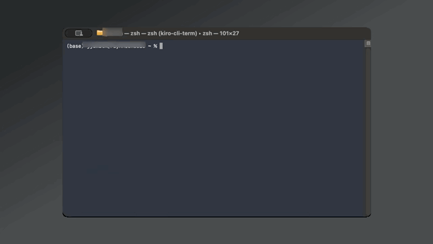

# callrx

> Beautiful amateur radio callsign lookup for the terminal

Look up any US amateur radio callsign from the [FCC Universal Licensing System](https://wireless2.fcc.gov/UlsApp/UlsSearch/searchLicense.jsp) directly in your terminal — with color output, clickable links, and a clean table layout.

[](https://github.com/binarynoir/callrx/actions/workflows/ci.yml)
[](https://github.com/binarynoir/callrx/actions/workflows/release-please.yml)
[](https://github.com/binarynoir/callrx/releases/latest)

[](https://buymeacoffee.com/binarynoir)
[](https://ko-fi.com/binarynoir)

---

## Demo



Links are **clickable** in [iTerm2](https://iterm2.com), [WezTerm](https://wezfurlong.org/wezterm/),
[Windows Terminal](https://aka.ms/terminal), [Kitty](https://sw.kovidgoyal.net/kitty/), and other
OSC 8-capable terminals.

---

## Installation

### Homebrew (macOS / Linux)

```bash
brew install binarynoir/callrx/callrx
```

Or tap first, then install:

```bash
brew tap binarynoir/callrx
brew install callrx
```

Upgrade later with `brew upgrade callrx`. The formula installs the prebuilt
release binary for your platform — no Rust toolchain required.

### Download a binary

Grab the latest binary for your platform from the [Releases page](https://github.com/binarynoir/callrx/releases):

| Platform              | File                                             |
| --------------------- | ------------------------------------------------ |
| macOS (Apple Silicon) | `callrx-vX.Y.Z-aarch64-apple-darwin.tar.gz`      |
| macOS (Intel)         | `callrx-vX.Y.Z-x86_64-apple-darwin.tar.gz`       |
| Linux x86_64          | `callrx-vX.Y.Z-x86_64-unknown-linux-gnu.tar.gz`  |
| Linux ARM64           | `callrx-vX.Y.Z-aarch64-unknown-linux-gnu.tar.gz` |
| Windows               | `callrx-vX.Y.Z-x86_64-pc-windows-msvc.zip`       |

**macOS / Linux:**

```bash
tar -xzf callrx-*.tar.gz
sudo mv callrx /usr/local/bin/
callrx --version
```

**Windows:** extract the `.zip` and add the folder to your `PATH`.

### Build from source

```bash
git clone https://github.com/binarynoir/callrx
cd callrx
cargo build --release
./target/release/callrx --version
```

Requires [Rust](https://rustup.rs) (stable toolchain, 1.75+).

---

## Usage

```txt
callrx [CALLSIGN]
callrx lookup <CALLSIGN> [OPTIONS]
callrx completions <SHELL>

OPTIONS:
    --json       Output raw JSON from callook.info
    --raw        Plain text output (no color, no formatting)
    --no-links   Disable clickable hyperlinks
    --help       Print help
    --version    Print version

SHELLS: bash, zsh, fish, elvish, powershell
```

**Examples:**

```bash
callrx W1AW                    # Quick lookup
callrx lookup KD9ABC           # Via subcommand
callrx lookup W1AW --json      # Raw JSON (pipe to jq)
callrx lookup W1AW --raw       # Plain text (pipe to grep)
callrx lookup W1AW | grep Grid # Colors stripped when piped
```

### Shell completions

Generate and install a completion script for your shell:

**zsh:**

```zsh
callrx completions zsh > ~/.zsh/completions/_callrx
# Ensure ~/.zsh/completions is in your $fpath (add to ~/.zshrc if needed):
# fpath=(~/.zsh/completions $fpath)
# autoload -Uz compinit && compinit
```

**bash:**

```bash
# Add to ~/.bashrc to load on every session:
eval "$(callrx completions bash)"
```

**fish:**

```fish
callrx completions fish > ~/.config/fish/completions/callrx.fish
```

**PowerShell:**

```powershell
callrx completions powershell >> $PROFILE
```

---

## Data source

Data comes from [callook.info](https://callook.info), which mirrors the FCC Universal
Licensing System (ULS) and updates weekly. callook.info is not affiliated with the ARRL
or the FCC — it is an independent service.

For the authoritative FCC record, click the **ULS Record** link in the output.

### Thanks to callook.info

`callrx` would not exist without [callook.info](https://callook.info) and its clean,
free JSON API. It is built and maintained by **Josh Dick**
([W1JDD](https://callook.info/w1jdd), [joshdick.net](https://joshdick.net)) as a
service to the ham radio community.

If `callrx` is useful to you, please consider
[**donating to callook.info**](https://callook.info/donate/) to help Josh cover
hosting costs and keep the service running. 73!

---

## Supported terminals (clickable links)

OSC 8 hyperlinks work in:

- [iTerm2](https://iterm2.com) (macOS)
- [WezTerm](https://wezfurlong.org/wezterm/) (macOS, Windows, Linux)
- [Windows Terminal](https://aka.ms/terminal) v1.4+
- [Kitty](https://sw.kovidgoyal.net/kitty/)
- [GNOME Terminal](https://help.gnome.org/users/gnome-terminal/) 3.26+
- Most VTE-based terminals

Links degrade gracefully to plain text in unsupported terminals or when output is piped.

---

## Development

Requires the stable [Rust](https://rustup.rs) toolchain (pinned in `rust-toolchain.toml`).

```bash
# Build
cargo build                       # debug build
cargo build --release             # optimized binary at target/release/callrx

# Run
cargo run -- W1AW                 # run against a callsign
cargo run -- W1AW --json          # the shorthand accepts the same flags as `lookup`

# Test
cargo test

# Lint & format (matches CI)
cargo fmt --check
cargo clippy --all-targets -- -D warnings
```

CI (`.github/workflows/ci.yml`) runs `fmt`, `clippy -D warnings`, `build`, and
`test` on Linux, macOS, and Windows for every push and pull request. It can also
be run on demand from the **Actions** tab.

---

## Releasing

Versioning is automated with [release-please](https://github.com/googleapis/release-please)
and driven by [Conventional Commits](https://www.conventionalcommits.org/) — you
**don't** edit the version in `Cargo.toml` by hand.

1. Merge work into `main` using conventional commit messages:

   | Commit prefix                      | Effect                     |
   | ---------------------------------- | -------------------------- |
   | `fix: …`                           | patch bump (0.1.0 → 0.1.1) |
   | `feat: …`                          | minor bump (0.1.0 → 0.2.0) |
   | `feat!: …` / `BREAKING CHANGE:`    | major bump (0.1.0 → 1.0.0) |
   | `chore:` `docs:` `refactor:` `ci:` | no release on their own    |

2. release-please opens and maintains a **Release PR** that bumps `Cargo.toml` +
   `Cargo.lock` and updates `CHANGELOG.md`. Review and merge it when you're ready
   to ship.
3. On merge it creates the `vX.Y.Z` tag and a GitHub Release (notes from the
   changelog), builds binaries for all platforms and attaches them, then
   regenerates the [Homebrew tap](https://github.com/binarynoir/homebrew-callrx)
   formula so `brew upgrade callrx` picks up the new version.

**Build targets:** macOS (Apple Silicon + Intel), Linux (x86_64, ARM64, ARMv7),
and Windows x86_64.

**Manual / re-release:** the **Release** workflow can also be run from the
**Actions** tab ("Run workflow" → enter an existing tag), or triggered by pushing
a `v*` tag directly.

> **One-time setup:**
>
> - In **Settings → Actions → General**, enable _"Allow GitHub Actions to create
>   and approve pull requests"_ so release-please can open the Release PR.
> - Add a `HOMEBREW_TAP_TOKEN` repo secret: a fine-grained PAT (or classic token
>   with `repo` scope) that can push to `binarynoir/homebrew-callrx`. The
>   `update-homebrew.yml` workflow uses it to commit the regenerated formula to
>   the tap. The default `GITHUB_TOKEN` cannot write to another repository.

---

## License

MIT
